# Tech-Environment-Setup

## Introduction

This is a step-by-step guide for the installation of neccessary tools and creation of accounts needed for the DevOps programmes. This project provides detailed instructions for the installation of Visual studio, Git, Virtual Box and Ubuntu on Virtual Box (Windows). Also the creation of neccessary accounts such as Github and Amazon Web Services (AWS) accounts.

 ## Tools needed to be Installed include the following:

 1. Visual Studio code (VScode)
 2. Git
 3. VirtualBox
 4. Ubuntu on Virtual box

 ## Accounts that are compulsory for this course are:

 1. GitHub
 2. AWS

 # Installation of Virtual Studio

 ## Step 1: Check System Requirements

 - Operating System: Windows 10/11
 - RAM: Minimum 4 GB (8 GB recommended)
 - Disk Storage: 20–50 GB of free space (varies by workload)
 - CPU Processor: 1.8 GHz or faster (quad-core recommended)

 ## Step 2: Download the Installer

1. Visited the [official website](https://code.visualstudio.com/download)
2. Click Download Visual Studio

## Step 3: Run the Installer

1. Double-click the downloaded file
2. Grant admin permissions if prompted

## Step 4: Choose Installation Location

- Default path: C:\Program Files\Microsoft Visual Studio\
- Change the location if needed (ensure sufficient disk space)

## Step 5: Begin Installation

- Click Install
- The installer downloads and installs components (requires internet)
- Progress bar shows status. This may take 30+ minutes depending on workloads

## Step 6: Launch Visual Studio

- Click Launch after installation completes. *Sign in with a Microsoft account (optional but recommended for syncing settings).
- Activate if using a paid edition (Community edition requires no activation)
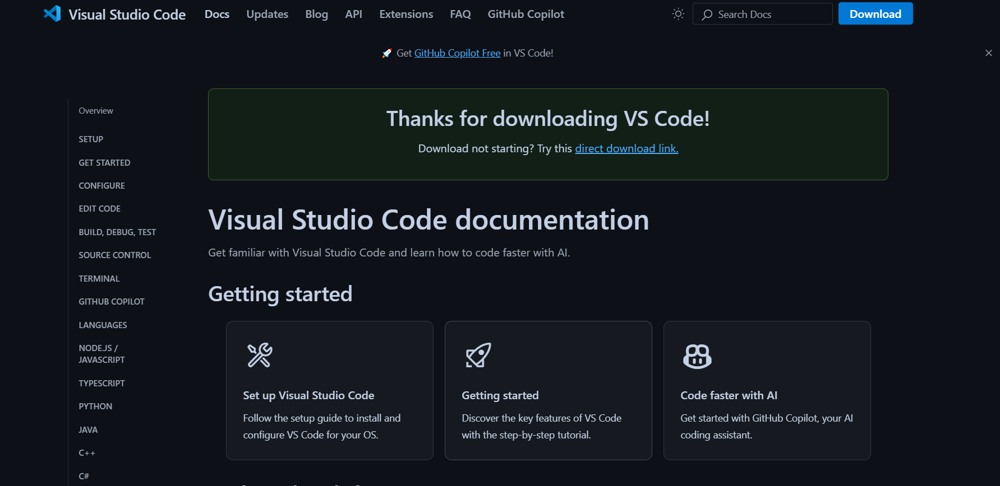


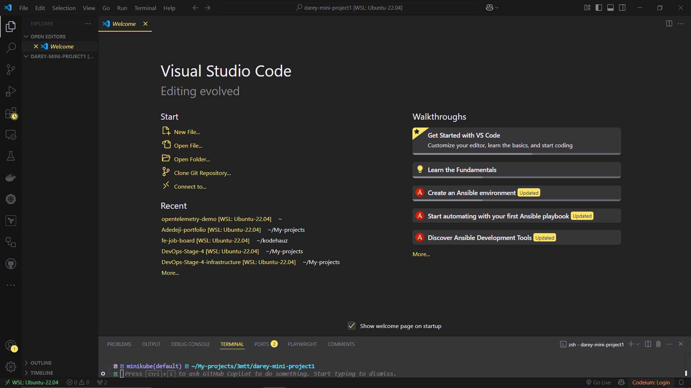
#
#
# Installation of Git

1. Go to [Git Download](https://git-scm.com/downloads)
2. Download the Windows installer

## Step 2: Install Git

1. Run the .exe file and follow the prompts. Keep default settings unless you need customization
   - Choose Git Bash as your terminal (recommended)
   - Select "Use Git and optional Unix tools from the Command Prompt" if you want Git commands in CMD
2. Complete the installation

## Step 3: Configure Git

Set your username and email:

```
git config --global user.name "Your Name"
git config --global user.email "your.email@example.com
```
To check configuration:
```
git config --list
```

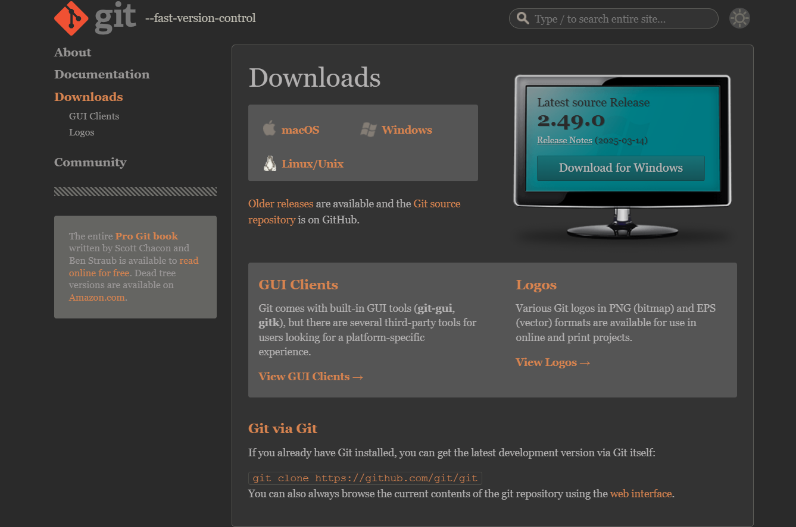


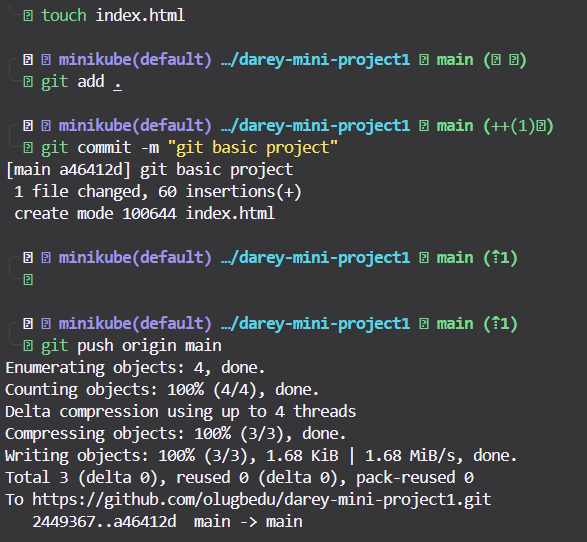
#
#
# Installation of Virtual Box (Oracle Virtual Box)

Installation of Virtual Box (Oracle Virtual Box)

1. Visited the [official website](https://www.virtualbox.org/wiki/Downloads) 
2. Click "Download VirtualBox"

3. Select the installer for your OS:
    * Windows: .exe file.
    * macOS: .dmg file.
    * Linux: Choose your distribution (e.g., Ubuntu/Debian .deb or Fedora .rpm)

## Step 2: Install VirtualBox
1. Double-click the downloaded .exe file
2. Click Next > Next
3. Customize installation (optional) or keep default settings
4. Allow installation of device drivers when prompted (click Install)
5. Click Finish to complete

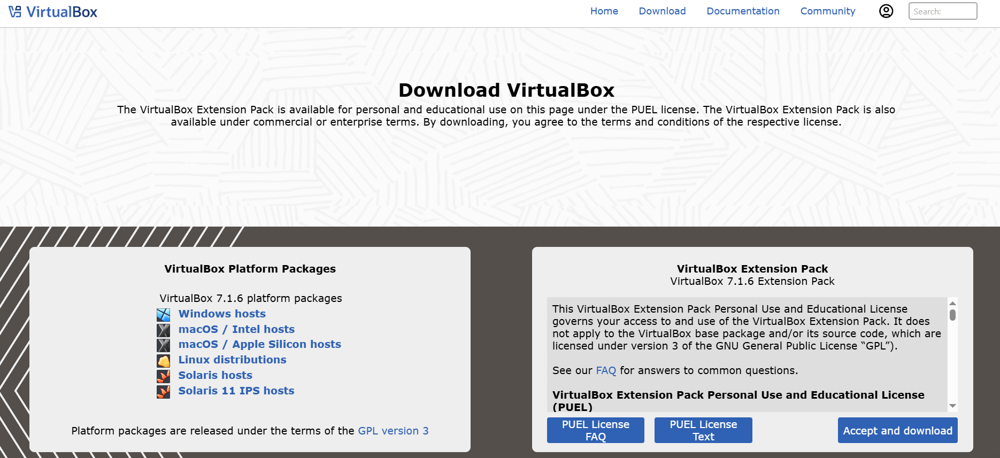

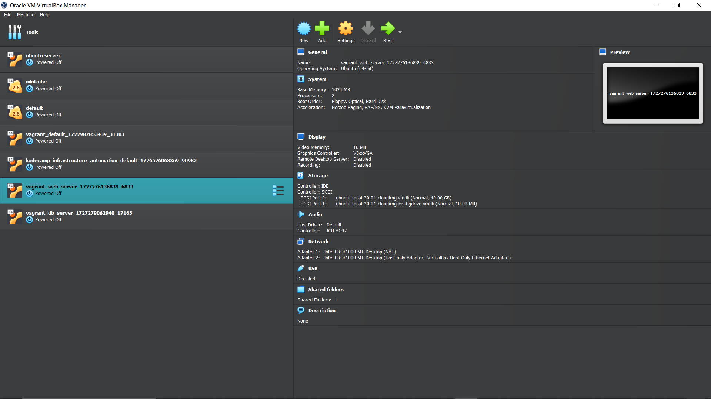
#
#
# Ubuntu on Virtual Box (Windows)

1. Visit the [Ubuntu downlaod](https://www.ubuntu.com/download/desktop) 
2. Download the LTS (Long-Term Support) version (e.g., Ubuntu 22.04 LTS) for stability.
3. Save the .iso file to your computer (e.g., in Downloads folder).

## Step 2: Create a New Virtual Machine

1. Open Oracle VirtualBox on your Windows PC.
2. Click New (top-left corner) to create a new VM.
Name: Enter a name (e.g., "Ubuntu 22.04")
    * Folder: Choose where to save the VM files (default is fine)
    * Type: Select Linux
    * Version: Choose Ubuntu (64-bit)
    * Click Next

## Step 3: Allocate Memory (RAM)
1. Assign RAM to the VM (recommended: 4GB or 4096MB)
2. Do not exceed 50% of your total RAM (e.g., 4GB if you have 8GB RAM)
3. Click Next

## Step 4: Create a Virtual Hard Disk
1. Select Create a virtual hard disk now
2. Click Create
3. Choose VDI (VirtualBox Disk Image) > Next.
4. Select Dynamically allocated (uses space as needed) > Next.
5. Set Disk Size:
6. Recommended: 25GB (adjust based on your needs).
7. Click Create

## Step 5: Mount Ubuntu ISO
1. Select your new VM in VirtualBox and click Settings (gear icon).
2. Go to Storage > Empty under Controller: IDE.
3. Click the CD/DVD icon next to "Optical Drive" > Choose a disk file.
4. Browse to your downloaded Ubuntu .iso file and select it.
5. Click OK.

## Step 6: Start the VM and Install Ubuntu
1. Select the VM and click Start (green arrow).
2. The Ubuntu installer will boot. Select Install Ubuntu.
3. Language: Choose your language > Continue.
4. Keyboard Layout: Select your keyboard > Continue.
5. Installation Type:
    * Select Erase disk and install Ubuntu (this only affects the VM, not your PC).
    * Click Install Now > Continue.
6. Timezone: Select your region > Continue.
7. User Setup:
    * Enter your name, computer name, username, and password.
    * Choose Log in automatically (optional).

## Step 7: Finish Installation
1. When prompted, click Restart Now.
2. Important: After the VM restarts, press Enter when you see "Please remove the installation medium."
3. VirtualBox will automatically eject the ISO. The Ubuntu login screen will appear.
4. Log in with your username and password.


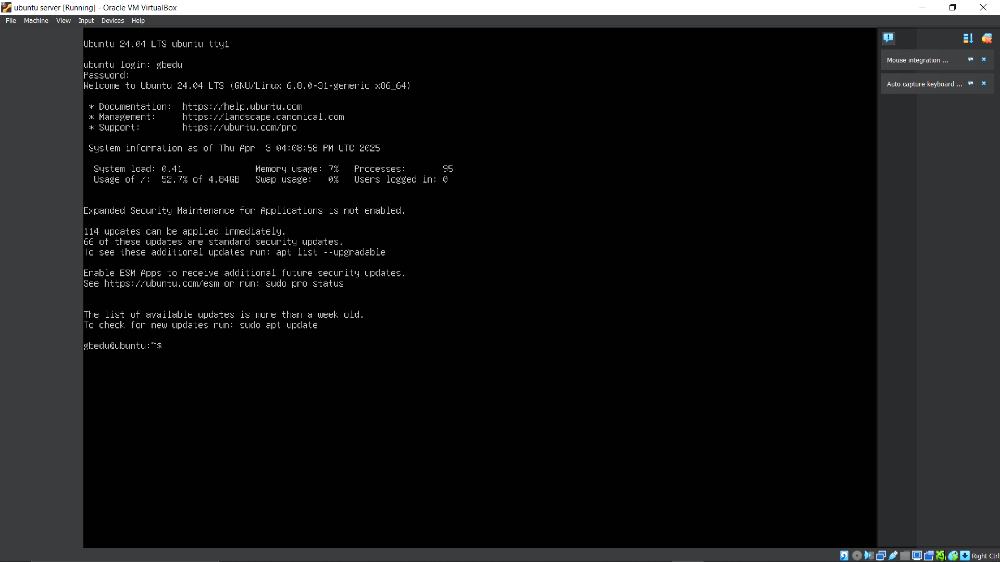
#
#
# Creating of Github Account
## Step 1: Go to GitHub’s Sign-Up Page
1. Open web browser (Chrome, Firefox, Edge, etc.)
2. Visit the [GitHub link](https://github.com/) 

## Step 2: Fill the signup page
1. Type a valid email address you can access (e.g., leolex7693@gmail.com).
2. Enter password and username

## Step 3: Verify Your Account
1. Complete the CAPTCHA to prove you’re not a robot.
2. Click Create account.

## Step 4: Verify Email
1. Check your email inbox for a verification email from GitHub.
2. Open the email and click Verify email address.

## Step 5: Complete Setup
* Email verification will take you to your GitHub dashboard

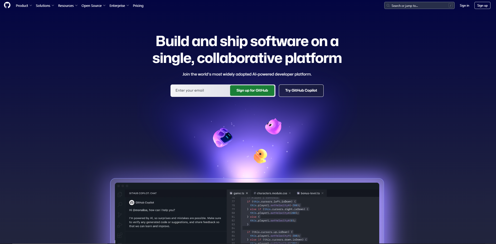

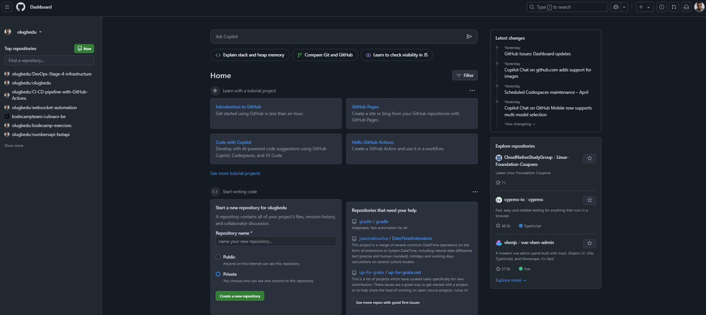


#
#
Creating of Amazon Web Services (AWS) Account
## Step 1: Visit the AWS Sign-Up Page

1. Go to[AWS Link](https://aws.amazon.com/free/)

2. Click Create an AWS Account (top-right corner)

## Step 2: Enter Account Details
1. Email Address: Use a valid email (e.g., ofrelex@gmail.com).
2. Click Verify email address.
    * AWS will send a verification code to your email.
3. Enter the verification code from the email.
4. Click Continue.

## Step 3: Add Contact Information
1. Account Type: Select Personal (for individual use) or Professional (for business).
2. Fill in your Full Name, Phone Number, and Country/Region.
3. Click Continue.

## Step 4: Add Payment Information
1. Credit/Debit Card: Enter card details (required for verification, even for the Free Tier).
2. AWS may charge $1 temporarily for validation (refunded later).
3. Billing Address: Fill in your address.
4. Click Verify and Continue.

## Step 5: Identity Verification
1. AWS will verify your identity via phone call or SMS.
2. Select your country code and enter your phone number.
3. Click Send SMS or Call Me Now.
4. Enter the PIN you receive.
5. Click Continue.

## Step 6: Select a Support Plan
1. Choose the Basic (Free) Support Plan.
    * This includes 24/7 customer service and access to forums.
    * Paid plans (Developer/Business) cost extra and are optional.
2. Click Complete sign up.

## Step 7: Confirm Account Activation
1. Wait for a confirmation email titled "Welcome to Amazon Web Services".
2. Log in to your AWS account: https://aws.amazon.com/console.
3. Access AWS Free Tier account


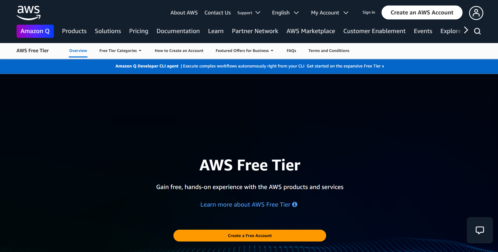

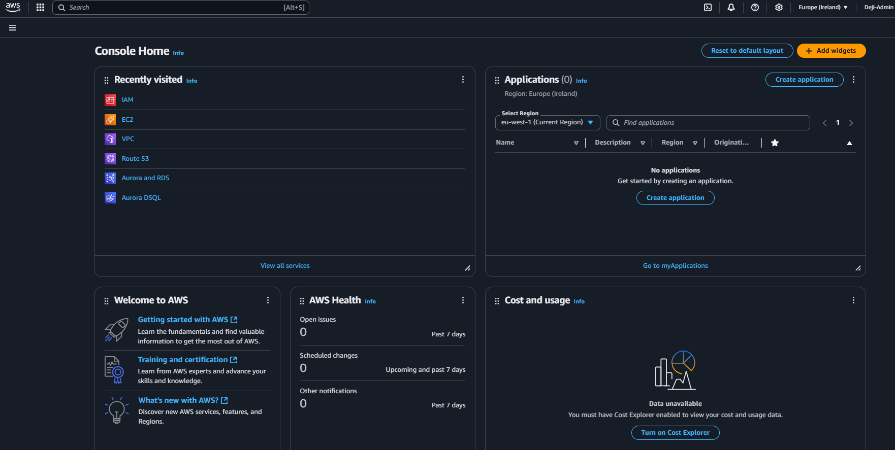
